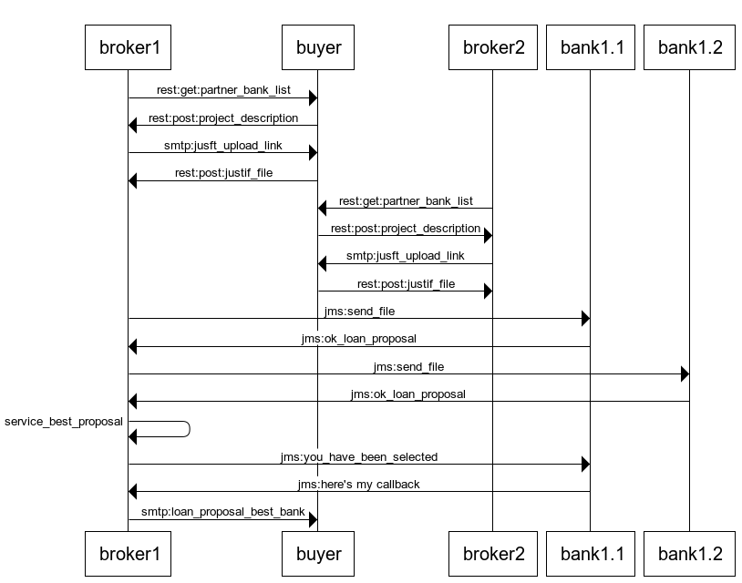
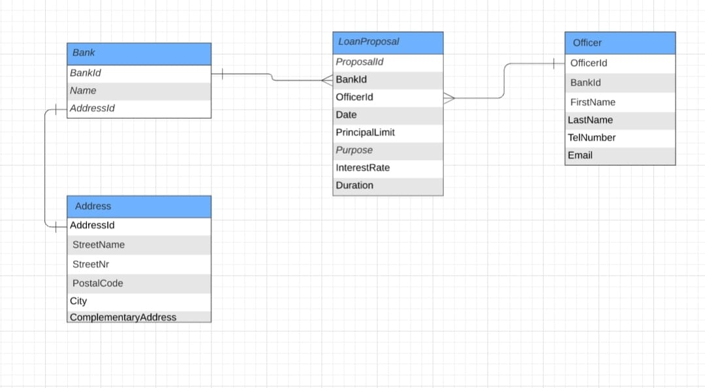
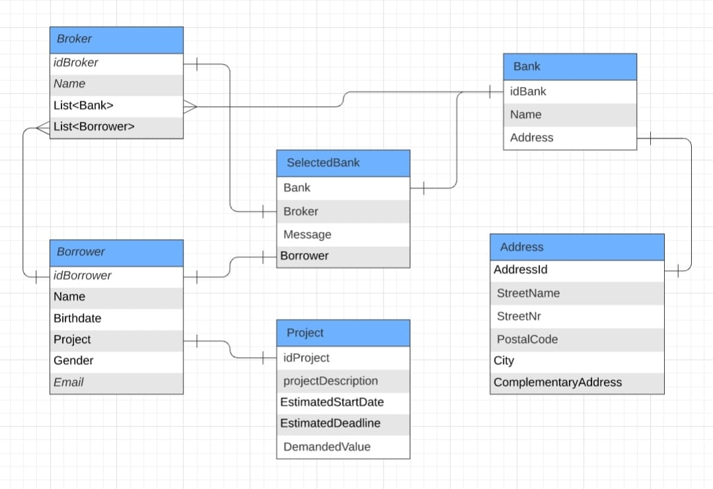

# INFO PROJET
On peut renvoyer une entité => LoanProposal DTO pas forcément utile
    => On peut envoyer DTO ou Entité

# bank-sub-system

Objectifs du système à modéliser : Obtention de financements.

On propose de modéliser un système d'acquisition (MASTER) d'un emprunt (loan) pouvant supporter plusieurs banques (bank)
ainsi que plusieurs courtiers (broker).
Le système master, gère 


Le courtier(broker) se caractérise d'intermédiaire entre la banque et l'acquéreur afin d'obtenir un emprunt au meilleur
taux selon le projet. Son rôle est de recevoir le dossier du client, déterminer avec le client quels sont les organismes 
de crédit à contacter parmi ceux partenaires au broker. Suite à cela, après été reçu par mail, le dossier client sera
aux organismes de crédit séléctionnés.

La banque/organisme de crédit(bank), propose une simulation de financement pour le projet dédié.

Lors de l'obtention d'une option de financement, on a plusieurs phases

Phase 1: collecte et envoie d'informations valides aux organismes de crédit concernés : 

- Rassembler et vérifier l'ensemble des pièces justificatives du dossier (broker)
- Déterminer les organismes de crédit à contacter (broker)

Phase 2: proposer une simulation de financement

- vérifier validité des rélevés de comptes en interne.
- vérifier validité avis imposition

Phase 3 :

-Génération de la simulation d'emprunt qui sera envoyée par la suite à l'Acquéreur.

## Amelioration possible
Possiblement 
- Transformer le JSON en PDF pour l'envoie au client

test
##Interfaces
```
broker1->buyer: rest:get:partner_bank_list
buyer->broker1: rest:post:project_description
broker1->buyer: smtp:jusft_upload_link
buyer->broker1: rest:post:justif_file

broker2->buyer: rest:get:partner_bank_list
buyer->broker2: rest:post:project_description
broker2->buyer: smtp:jusft_upload_link
buyer->broker2: rest:post:justif_file

broker1->bank1.1: jms:send_file
bank1.1->broker1: jms:ok_loan_proposal
broker1->bank1.2: jms:send_file
bank1.2->broker1: jms:ok_loan_proposal
broker1->broker1: service_best_proposal
broker1->bank1.1: jms:you_have_been_selected
bank1.1->broker1: jms:here's my callback

broker1->buyer: smtp:loan_proposal_best_bank
```

## Schéma relationnel
### Bank System

### Broker System

