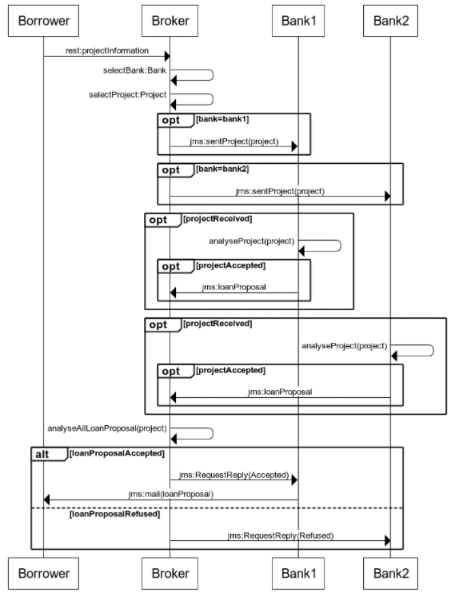
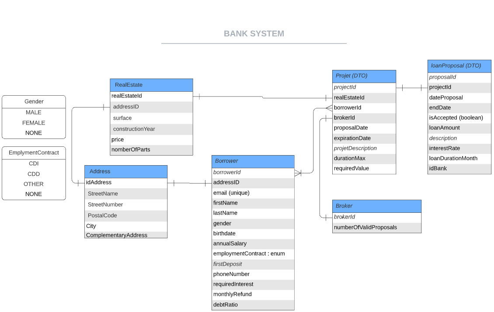
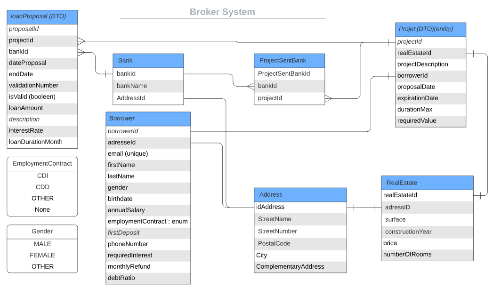

# bank-sub-system

##Objectifs du système à modéliser :

On propose ici de modéliser un système de gestion de l'acquisition d'un emprunt entre un Borrower(client) et une banque
grâce à un Broker(courtier).
A noter que ces emprunts se feront uniquement pour l'achat de biens immobiliers (appartements, maisons, chateaux, ...).

Le courtier(broker) se caractérise comme un intermédiaire entre la banque et l'acquéreur afin d'obtenir un emprunt au meilleur
taux selon un projet client.
Son rôle est de recevoir le projet du client; et de déterminer à quelle banque partenaire l'envoyer.


Le système Bank, génère des propositions d'emprunts (loan proposal) selon un projet qui lui est soumis.
Cette proposition, pourra prendre différentes formes selon les banques et les règles métiers qu'elles fixent on en trouve
de deux sortes
Les légales
    - l'age minimum => Etre majeur
    - le taux d'endettement => Ne doit pas dépasser 35%
    - La durée maximum => Ne doit pas dépasser 25 ans
Celles propre à la banque
    - L'age maximum
    - La fidélité du broker => Plus un broker aura envoyé de projet plus son taux sera avantageux


La réalisation d'une proposition d'emprunt s'effectue en plusieurs phases :

###Phase 1 : Création et envoie d'un projet dans le système du broker

Le client(borrower) remplit un formulaire de création d'un projet de demande d'emprunt. Ce formulaire possède
ses informations personnelles (adresse, nom, Prénom..), des informations sur le bien qu'il désire acquérir à la suite
de cet emprunt. Ce formulaire, se situe au localhost du projet (http://localhost:8080/) après avoir effectué
la commande [quarkus dev] dans le terminal de commande dans le répertoire courant du système "loan-broker".

Une fois le formulaire validé et envoyé, un projet sera créé pour ce client et mit dans la BDD.
Le broker(courtier), pourra ainsi observer l'ensemble des projets qui ont été créés et qui lui ont été soumis.
Il pourra ensuite choisir, grâce à un nouveau formulaire situé à l'adresse suivante (http://localhost:8080/ProjectSummary.html),
d'envoyer ce projet aux banques partenaires qu'ils désirent.


###Phase 2 : Réception du project et génération d'une proposition d'emprunt
Après avoir fait un [-Dquarkus.profile=bank1] qui permet de lancer le profil de la bank 1
Le Système de la bank (loan-bank) reçoit sur une queue:JMS les différents projets que le broker lui a soumis.
Suite à cette reception, selon les règles métiers définies par la banque, une proposition
d'emprunt sera générée si le projet correspond à ses règles.
Elle se verra transmise par la suite au courtier(broker) par le moyen d'une queue:JMS.


###Phase 3 : Choix d'un loan Proposal
Le Broker reçoit les loan proposals (les projets qui ont été validés par les banques) à l'adresse (http://localhost:8080/summaryLoanProposal.html)

Il choisit parmis ses loan proposals celle qu'il considère comme la meilleure

Un message Reply est envoyé à la banque lui informant que son loan proposal a été choisi

La banque envoie donc un mail au client (borrower) avec les informations du prêt

##Interfaces
```
Borrower->Broker : rest:projectInformation
Broker->Broker : selectBank:Bank  
Broker->Broker : selectProject:Project

opt bank=bank1 
    Broker->Bank1 : jms:sentProject(project)
end

opt bank=bank2
    Broker->Bank2 : jms:sentProject(project)
end

opt projectReceived
    Bank1->Bank1 : analyseProject(project)
    opt projectAccepted
        Bank1->Broker : jms:loanProposal
    end
end

opt projectReceived
Bank2->Bank2 : analyseProject(project)
    opt projectAccepted
        Bank2->Broker : jms:loanProposal
    end
end
Broker->Broker : analyseAllLoanProposal(project)
alt loanProposalAccepted
    Broker ->Bank1 : jms:RequestReply(Accepted)
    Bank1 -> Borrower : jms:mail(loanProposal)
else loanProposalRefused
    Broker ->Bank2 : jms:RequestReply(Refused)
end


```

## Schéma relationnel
### Bank System

### Broker System

