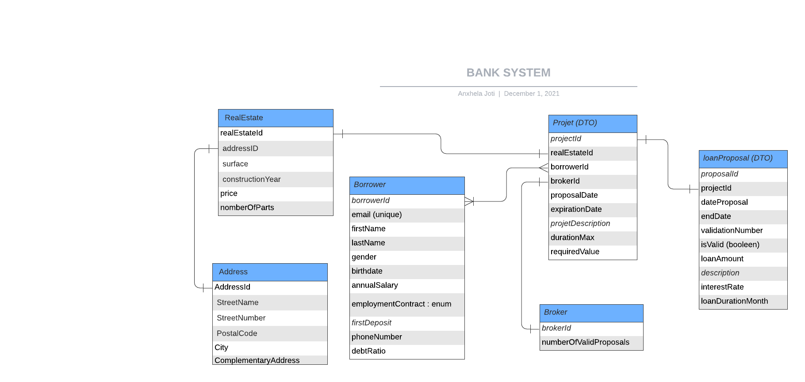

# bank-sub-system

##Objectifs du système à modéliser : 

On propose ici de modéliser un système de gestion de l'acquisition d'un emprunt entre un Borrower et une banque 
à partir d'un Broker.
Ces emprunts se feront uniquement pour l'achat de biens immobiliers ( appartements, maisons, chateaux..).

Le courtier(broker) se caractérise d'intermédiaire entre la banque et l'acquéreur afin d'obtenir un emprunt au meilleur
taux selon le projet. Son rôle est de recevoir le dossier du client, déterminer avec le client quels sont les organismes
de crédit à contacter parmi ceux partenaires au broker. 
Suite à sa création par le biai d'une interface formulaire, le projet sera envoyé vers les banques désirées.

Le système Bank, génère des propositions d'emprunts (simulation de financement) selon un projet qui lui est soumis.
Cette proposition, pourra prendre différentes formes selon chacune des banques et les modalités (exigences métier) qu'elle
possède :
    - tranche d'âge 
    - Remboursement ?..
    -> A compléter avec la logique métier que Abel a implementé.

La simulation de financement s'effectue en plusieurs phases :

-Le borrower remplit le formulaire de conception d'un projet via le formulaire définit au localHost
- Envoie de ce projet à la banque par le broket 
- Génération d'une proposition de financement (loanProposal) par la banque qui est ensuite envoyée au Broker
- Broker choisit ou non la proposition la plus intéressante si plusieurs sont émises de banques différentes pour un même projet
- ? Mail vers le borrower? Vers le broker => A finir. 


La réalisation d'une proposition d'emprunt s'effectue en plusieurs phases : 

###Phase 1 : Création et envoie d'un projet dans le système du broker 

Le client(borrower) remplit un formulaire de création d'un projet de demande d'emprunt. Ce formulaire possède
ses informations personnelles (adresse, nom, Prénom..), des informations sur le bien qu'il désire acquérir à la suite
de cet emprunt. Ce formulaire, se situe au localhost du projet (http://localhost:8080/) après avoir effectué 
la commande [quarkus dev] dans le terminal de commande dans le répertoire courant du système "loan-broker".

Une fois le formulaire valide et envoyé, un projet sera crée pour ce client.
Le broker(courtier), pourra ainsi observer l'ensemble des projets qui ont été crées et qui lui ont été soumis.
Il pourra ensuite choisir, grâce à un nouveau formulaire situé à l'adresse suite (http://localhost:8080/ProjectSummary.html),
envoyer ce projet client à ses banques partenaires qui ont été retenues par le borrower.


###Phase 2 : Réception du project et génération d'une proposition d'emprunt 

La bank reçoit sur une queue:JMS les différents projets qu'on lui propose, il les affiche et les analyse
Selon des règles métiers précises.

Les projets qui sont acceptés sont transformées en loanProposal et sont renvoyées au Broker

###Phase 3 :
Le Broker reçoit les loan proposals (les projets qui ont été validés par la banque)

Il choisit parmis ses loan proposals celle qu'il considère comme la meilleure

Puis envoie un email au Client avec la meilleure loanProposal

## Amelioration possible
Possiblement 
- Transformer le JSON en PDF pour l'envoie au client

test
##Interfaces
```
broker1->buyer: rest:get:partner_bank_list
buyer->broker1: rest:post:project_description
broker1->buyer: smtp:jusft_upload_link
buyer->broker1: rest:post:justif_file

broker2->buyer: rest:get:partner_bank_list
buyer->broker2: rest:post:project_description
broker2->buyer: smtp:jusft_upload_link
buyer->broker2: rest:post:justif_file

broker1->bank1.1: jms:send_file
bank1.1->broker1: jms:ok_loan_proposal
broker1->bank1.2: jms:send_file
bank1.2->broker1: jms:ok_loan_proposal
broker1->broker1: service_best_proposal
broker1->bank1.1: jms:you_have_been_selected
bank1.1->broker1: jms:here's my callback

broker1->buyer: smtp:loan_proposal_best_bank
```

## Schéma relationnel
### Bank System

### Broker System

